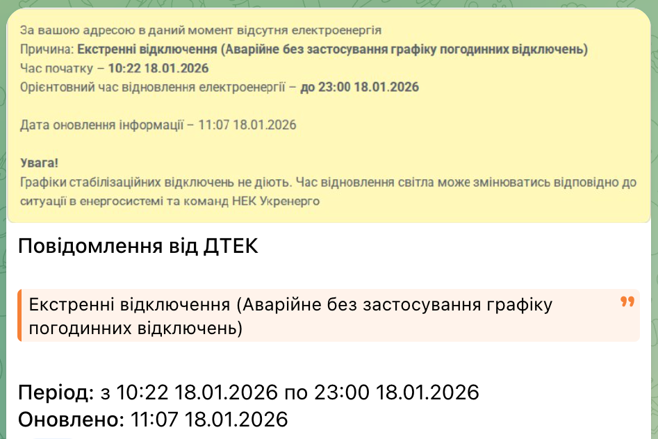
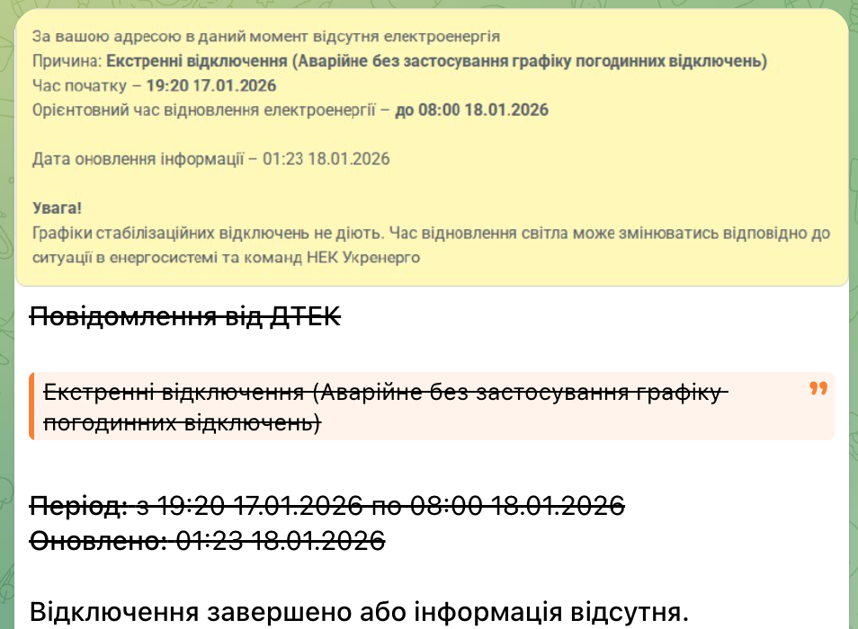

# DTEK Emergency Alert Bot 🚨

[](https://hub.docker.com/r/ruslanmelnychenko/dtek-emergency-alert/tags)
[](https://hub.docker.com/r/ruslanmelnychenko/dtek-emergency-alert)

Бот для автоматичного відстеження та сповіщення про екстрені відключення електроенергії на сайті ДТЕК Київські електромережі. Бот робить скріншот актуального стану відключень та надсилає його в Telegram при зміні інформації.

## Особливості
- 📸 **Скріншоти**: Надсилає візуальне підтвердження з сайту ДТЕК.
- 🔄 **Автооновлення**: Редагує існуюче повідомлення при зміні статусу або закреслює його після завершення відключення.
- ⚙️ **Конфігурація**: Гнучке налаштування через змінні оточення.
- 🐳 **Docker-ready**: Легкий запуск через Docker Compose з усіма залежностями Playwright.

## Приклади
### Нове повідомлення

### Закреслює повідомлення коли в ДТЕК зникає повідомлення


## Швидкий старт (Docker)

1. **Використовуйте готовий образ (рекомендовано):**
   Ви можете використовувати вже зібраний образ з Docker Hub:
   ```bash
   docker run -d --name dtek-bot \
     --env-file .env \
     -v $(pwd)/data:/data \
     ruslanmelnychenko/dtek-emergency-alert:latest
   ```
   Або docker-compose.yml
   ```yaml
   services:
      dtek-monitor-bot:
         image: ruslanmelnychenko/dtek-emergency-alert:latest
         restart: unless-stopped
         environment:
            - TELEGRAM_BOT_TOKEN=""
            - TELEGRAM_CHAT_ID=""
            - STREET="вул. Хрещатик"
            - HOUSE="10"
         volumes:
            - dtek-monitor-bot-data:/data

   volumes:
      dtek-monitor-bot-data:
   ```

2. **Або клонуйте репозиторій для локальної збірки:**
   ```bash
   git clone https://github.com/RuslanMelnychenko/dtek-emergency-alert.git
   cd dtek-emergency-alert
   ```

3. **Налаштуйте змінні оточення:**
   Скопіюйте приклад конфігурації та вкажіть свої дані:
   ```bash
   cp .env.example .env
   ```
   Відредагуйте `.env`, додавши ваш `TELEGRAM_BOT_TOKEN`, `TELEGRAM_CHAT_ID` та адресу.

3. **Запустіть бота:**
   ```bash
   docker-compose up -d
   ```

## Запуск бінарного файлу (Local)

Для локального запуску необхідно мати встановлений Go та залежності Playwright.

1. **Встановіть залежності:**
   ```bash
   go mod download
   ```

2. **Встановіть Playwright та браузери:**
   ```bash
   go run github.com/mxschmitt/playwright-go/cmd/playwright install --with-deps chromium
   ```

3. **Скомпілюйте та запустіть:**
   ```bash
   go build -o dtek-bot cmd/bot/main.go
   export TELEGRAM_BOT_TOKEN="your_token"
   export TELEGRAM_CHAT_ID="your_chat_id"
   # ... інші змінні ...
   ./dtek-bot bot-checking --check-interval 300
   ```

## Налаштування (.env)

| Змінна               | Опис                                                                                                                               | За замовчуванням                               |
|----------------------|------------------------------------------------------------------------------------------------------------------------------------|------------------------------------------------|
| `TELEGRAM_BOT_TOKEN` | **Обов'язково**: Токен вашого Telegram бота                                                                                        | -                                              |
| `TELEGRAM_CHAT_ID`   | **Обов'язково**: ID чату куди надсилати сповіщення                                                                                 | -                                              |
| `STREET`             | **Обов'язково**: Назва вулиці (як на сайті ДТЕК)                                                                                   | -                                              |
| `HOUSE`              | **Обов'язково**: Номер будинку (як на сайті ДТЕК)                                                                                  | -                                              |
| `TIME_FORMAT`        | Формат часу для повідомлень                                                                                                        | 15:04 02.01.2006                               |
| `TIME_LOCATION`      | Часовий пояс                                                                                                                       | Europe/Kyiv                                    |
| `SCREENSHOT_PATH`    | Шлях до скріншоту                                                                                                                  | data/currentOutstage.jpeg                      |
| `PREV_FILE_PATH`     | Шлях до файлу зі станом                                                                                                            | data/prevData.json                             |
| `NO_OUTAGE_TEXT`     | Текст, яким доповнюється (закреслене) повідомлення, коли відключення завершилось або повідомлення зникло з сайту                   | Відключення завершено або інформація відсутня. |
| `IGNORE_TEXTS`       | Список текстів через `\|`: якщо текст відключення містить хоча б один із них, повідомлення ігнорується (як ніби відключення немає) | -                                              |

### Приклад використання `IGNORE_TEXTS`

Якщо ДТЕК показує повідомлення про відключення за графіком і ви не хочете отримувати про нього сповіщення, додайте частину цього тексту:

```env
IGNORE_TEXTS=Згідно графіку погодинних відключень
```

Кілька текстів розділяються символом `|`:

```env
IGNORE_TEXTS=Згідно графіку погодинних відключень|Інший текст для ігнорування
```

Якщо текст відключення містить хоча б один із цих фрагментів (без урахування регістру), бот вважатиме, що повідомлення немає.

Оскільки при ігноруванні планових відключень стандартний підпис «Відключення завершено або інформація відсутня.» може вводити в оману, його можна змінити через `NO_OUTAGE_TEXT`:

```env
IGNORE_TEXTS=Згідно графіку погодинних відключень
NO_OUTAGE_TEXT=Немає повідомлень про позапланові відключення
```

## Автоматизація збірки (GitHub Actions)

При кожному релізі (створенні тегу `v*`) образ автоматично збирається та публікується на Docker Hub.
Для роботи цього у вашому репозиторії GitHub необхідно додати такі **Secrets** (`Settings -> Secrets and variables -> Actions`):
- `DOCKERHUB_USERNAME`: ваше ім'я користувача на Docker Hub.
- `DOCKERHUB_TOKEN`: [Access Token](https://docs.docker.com/security/for-developers/access-tokens/) для Docker Hub з правами **Read, Write, Delete** (потрібні для автоматичного оновлення опису образу з `README.md`).

## Технології
- [Go](https://golang.org/)
- [Playwright for Go](https://github.com/mxschmitt/playwright-go)
- [Telegram Bot API for Go](https://github.com/go-telegram-bot-api/telegram-bot-api)

## Ліцензія
MIT
